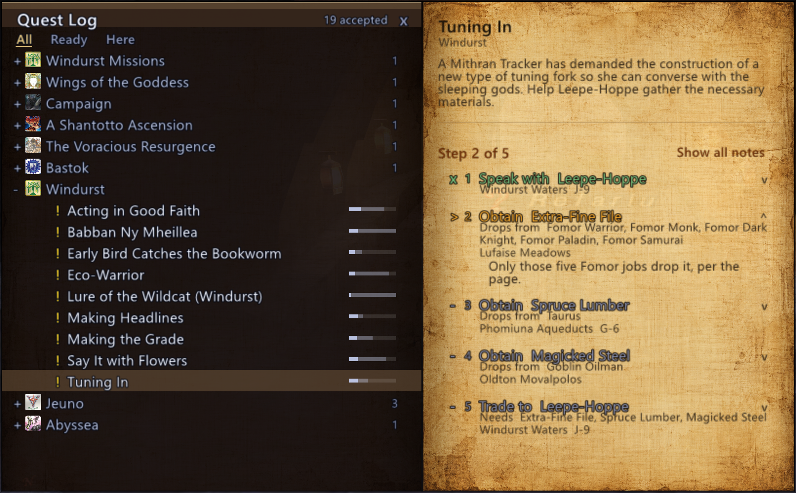

# questmarks-ui

Your **accepted** quests as a browsable in-game list, grouped by the game's own
quest-log regions, built on [questmarks](https://github.com/DrNefarius/questmarks/)' data.

```
//lua load questmarks-ui
```

A closed book appears. Click it to open the quest log, click it again to close.
Drag it wherever you like and it stays there. `//qmui` still opens and closes the
log, so it can go on a macro.

**!! KNOWN ISSUE: The first click into the UI after loading could take a couple of seconds during which time the game does not seem to respond. Just give it a couple of seconds and it'll return back to normal and every subsequent click will be fast. !!**

---

## Requires

**questmarks, installed**, though not necessarily loaded. It is found
automatically at `<Windower>/addons/questmarks/`; override with
`//qmui path <folder>`. This addon reads questmarks' data and runs its `core/`
modules in its own Lua state. It never writes to questmarks and never modifies
it.

Two features read questmarks' `build/` off your own disk rather than shipping any
of it: each quest's **description**, which is the text of your own in-game quest
log, from `build/rendered/`; and each step's **player-facing note** from
`build/authored/`. Without them the two features are simply absent: no
description, no notes, and a step with no note stops being expandable. Nothing
else changes and nothing breaks.

If questmarks is missing, is the wrong version, or the game has not sent your
quest log yet, the panel says which in a sentence and does nothing else. It never
throws. `//qmui diag` reports exactly what it found, including which of these
optional pieces are present.

## What it does


*(showing the 'mixed' style)*

- **Grouped by region**, using the client's own quest-log sections. Collapsible,
  in a fixed order, each with its own badge from BG Wiki's category artwork.
- **A coloured mark per row**, its hue taken from questmarks' own
  `render/markers.lua` at runtime so it cannot drift from the world: yellow
  quest, green mission, red Campaign, blue for a repeatable this character has
  been seen to finish before. `!` means you are still working on it, `?` means it
  is ready to hand in. Beside it, where to go: NPC, zone, map grid, and a bar
  showing how much of the ladder is confirmed rather than guessed.
- **A detail pane on demand**, opening only when you select something. It carries
  the step ladder with a verdict on each step, what the step needs you to be
  carrying, where those items drop from, the game's own quest description, and a
  player-facing note. The last two come from questmarks' `build/`, see
  [Requires](#requires).
- **Honest about what it cannot see.** 5631 of the index's 6866 steps carry no
  evidence the client will report, so the ladder often cannot tell which of
  several steps you are on. It says so, and shows what each one involves rather
  than pointing at one of them.
- **Four backgrounds** switchable with `//qmui bg <name>`, each held to a
  measured contrast floor by the test suite, and `//qmui opacity <n>` to see
  the world through the panel. Opacity moves the panel surfaces only: the text
  keeps its own alpha, so those contrast floors still describe what is drawn.

## Commands

| | |
|---|---|
| `//qmui` | open / close |
| `//qmui accepted` / `handin` / `here` | everything accepted (default) / only what is ready to hand in / only what is in this zone |
| `//qmui search <text>` | filter by quest or region name; no argument clears |
| `//qmui next` / `prev` / `pick <n>` | move the selection |
| `//qmui scroll <n>` / `top` / `bottom` | scroll the list |
| `//qmui steps <n>` | scroll the detail pane |
| `//qmui fold <region>` / `foldall` / `unfoldall` | collapse regions |
| `//qmui list` | print the whole list to chat instead |
| `//qmui pos <x> <y>` / `scale <0.6-2.5>` | move / resize |
| `//qmui icon` / `icon on` / `icon off` | show or hide the book |
| `//qmui icon pos <x> <y>` | move the book without the mouse |
| `//qmui bg <name>` | pane background: navy, leather, parchment or mixed |
| `//qmui opacity <0.15-1>` | how solid the panel is; no argument reports it |
| `//qmui path <folder>` | where questmarks is installed |
| `//qmui reload` / `diag` | re-read the index / what is loaded |

Mouse: click the book to open or close the log and drag it to move it; click a row
to open its detail, a header to fold, the `x` to close, and use the wheel to
scroll. Where the book overlaps the open window the window takes the click,
because this platform gives an addon no z-order control.

## Testing

```bash
luajit tools/smoke.lua
```

Loads the addon against a stub client, drives every command, feeds real `0x056`
packets through the real handler, exercises every degradation path, and rasterises
the recorded draw calls to ASCII so layout can be checked without the game. It
asserts, among other things, that unload leaves **zero** named prims behind,
because an orphan stays on screen until Windower restarts.

```bash
luajit tools/check_dialect.lua
```

Refuses constructs the in-game Lua 5.1 cannot parse. The harness runs LuaJIT,
which accepts Lua 5.2 `goto`, so a green suite is not by itself evidence that the
addon loads. It runs first inside `smoke.lua` too.

Both scripts want **LuaJIT**, and both work out where they are from their own
invocation path rather than the working directory, so they run from a clone
anywhere and from an absolute path out of another directory.

The Python scripts in `tools/` regenerate assets and are not part of testing:
`genmetrics.py` rebuilds the font width table, `make_category_icons.py` the
region badges, and `make_pages.py` re-derives the two page sheets from
`papyrus.png`. Run the last one if you replace the papyrus or change either
pane's width. They need Python 3 with Pillow, and `genmetrics.py` reads the
Segoe UI files out of the system font directory.

`make_category_icons.py` also needs the BG Wiki originals, which are not in the
repository because they are the wiki's files rather than this addon's.
`tools/category-sources/fetch_icons.py` downloads them again, re-deriving each
URL from questmarks' cached category pages and rewriting the manifest as it
goes; that directory's README explains the whole chain.

`.gitignore` says what is not published and why. Everything else here ships.

## Credits and licence

Quest data, and the entire model layer, are questmarks'. Its `NOTICE` records the
provenance of that data, BG Wiki under CC BY-NC-SA 3.0 and FFXI game content
(C) SQUARE ENIX, and applies unchanged to anything this addon puts on screen.
This is an unofficial, non-commercial fan tool with no affiliation to Square
Enix.

**`assets/papyrus.png` is DrNefarius' own work**, made for this addon, and
`assets/page_left.png` / `page_right.png` are derived from it by
`tools/make_pages.py`. The two book icons are commissioned originals, drawn for
this addon.

**`assets/category/` is third-party and is the only part that is.** The 17 region
badges are derived from BG Wiki's own category images under CC BY-NC-SA 3.0:
attributed, non-commercial, and offered on under the same licence.

`chronicle/ui/` was **read**, to learn how a quest browser is built on this
platform. No code or data comes from it.

`NOTICE` is the full account: every asset, where it came from, the three
CC obligations and how each is met, and why this addon ships no note or
description text of its own.
